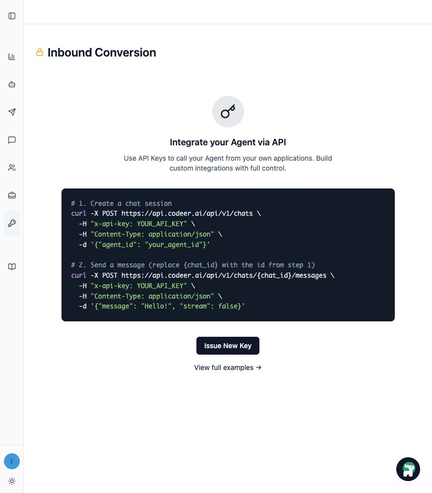
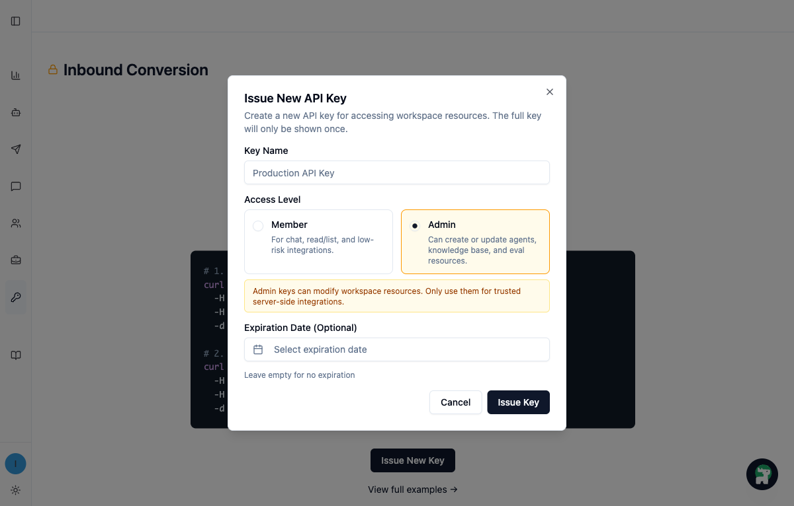

# Codeer Agent Skill 客戶安裝指南

這份指南協助你完成 **Codeer CLI** 與 **Codeer Agent Skill** 安裝。

重點不是避開 Web UI，而是讓 Codex / Claude Code 能參與完整的 Codeer
Agent 生命週期：從資料整理、Agent 規劃、Behavior Cases、Production
History 分析，到下一輪迭代。

## 先分清楚：CLI 和 Skill 各自負責什麼？

### Codeer CLI

Codeer CLI 是安裝在本機的 `codeer` 指令工具。

它負責：

- 登入 Codeer
- 連接 Codeer API
- 執行 `codeer agent`、`codeer eval`、`codeer history`、`codeer kb` 等指令
- 驗證 API key、workspace、agent 權限是否正常

### Codeer Agent Skill

Codeer Agent Skill 是安裝到 Codex / Claude Code 的工作說明。

它負責讓 assistant 知道：

- Codeer Agent 生命週期怎麼走
- 如何從 KB / 檔案討論並建立 Agent v0
- 如何產生 Behavior Cases
- 如何分析 Production History / Negative Feedback
- 什麼時候要先讓你看會改哪些內容，再由你確認是否套用或發布

## Codeer Agent Skill 可以發揮什麼威力

1. **從 KB / 檔案開始規劃並創建 Agent v0**

   把文件、FAQ、SOP、產品資料或資料夾交給 Codex / Claude Code，先討論
   Agent 範圍、知識邊界與初版設計。

2. **產生 Behavior Cases**

   依照目標使用情境建立行為分類、測試案例與評分標準，讓品質討論有具體
   依據。

3. **根據失敗問題作出調整**

   失敗不一定代表 prompt 錯；也可能是 KB、Agent、retrieval、Standard /
   Rubric 需要修正。

4. **分析 Production History / Negative Feedback**

   從真實對話和負評中找出模式、缺口與高風險場景，讓下一輪改善有證據。

5. **協助你開始下一輪的迭代**

   先整理問題、提出修正、預覽會改哪些內容，再由你確認是否套用或發布。

## Step 1：在 Codeer 建立 API Key

請使用目標 workspace 的 **Admin API key**。Skill 會透過 CLI 做 Agent、
KB、Behavior Cases 和 History 相關工作，因此初次設定建議使用 Admin
權限。



在 workspace 頁面左側打開 **API Keys**，點選 **Issue New Key**。



輸入容易辨識的名稱，例如 `Codex` 或 `Claude Code`，Access level 選
**Admin**。

完整 API key 只會顯示一次。請立即存到安全位置，不要貼進聊天、prompt、
Git repo、專案 `.env` 或 `.claude/settings.json`。

## Step 2：安裝 Codeer CLI

Codeer Agent Skill 會透過本機 `codeer` CLI 操作 Codeer API。建議使用
`pipx` 安裝，讓 CLI 跟專案 Python 環境分開，比較容易維護。

安裝 CLI：

```bash
pipx install codeer-cli
```

確認指令可用：

```bash
codeer --help
```

如果沒有 `pipx`：

```bash
python -m pip install --user pipx
python -m pipx ensurepath
```

重開 terminal 後，再執行：

```bash
pipx install codeer-cli
```

維護更新：

```bash
pipx upgrade codeer-cli
codeer check
```

不建議把 `python -m pip install codeer-cli` 當作主要安裝方式。它可以作為
fallback，但 `pipx` 較不容易受到專案套件版本影響。

## Step 3：設定本機 CLI Profile

Profile 會把 API key 存在使用者層級的 Codeer CLI config，不需要放進
Codex 或 Claude Code 的設定檔。

下面的 `work` 只是範例 profile 名稱。你可以換成自己容易辨識的名字，例如
`codeer`、`prod`、`client-a` 或 `support-agent`。如果你改了名稱，後面的
`codeer profile use ...` 也要使用同一個名字。

新增 profile：

```bash
codeer profile add work
```

CLI 會請你貼上 API key，輸入時不會顯示在畫面上。

選用 profile：

```bash
codeer profile use work
```

檢查 CLI 與 API 是否可用：

```bash
codeer check
codeer agent list
```

這只能確認 CLI 和 API credential 正常，還不是 Skill 驗證。

如果專案只有一個預設 Agent，可以選填：

```bash
export CODEER_AGENT_ID=<agent-id>
```

不要把 `CODEER_API_KEY` 放進 `.claude/settings.json`、專案 `.env`、聊天訊息
或 Git commit。

## Step 4：安裝 Codeer Agent Skill

現在 Skill 已放在公開 GitHub repo。安裝時請使用 `codeer-agent` 資料夾
URL，不要使用 repository root。

### Claude Code

```bash
claude install-skill https://github.com/codeer-ai/codeer-skills/tree/main/codeer-agent
```

### Codex

```text
$skill-installer install https://github.com/codeer-ai/codeer-skills/tree/main/codeer-agent
```

如果安裝後沒有看到 skill，請重新啟動 Codex。

## Step 5：驗證 Skill 是否被載入

請在 Codex / Claude Code 中問下面這句。這是在確認 assistant 是否真的知道
Codeer Agent 生命週期，而不是只確認 CLI 能不能連線。

```text
Please confirm whether the Codeer Agent Skill is loaded. Explain how you can
help me plan an Agent from KB/files, create behavior cases, analyze production
history, and show me proposed changes before applying them.
```

理想回答應該提到：

- Agent lifecycle
- Behavior Cases
- Production History
- 在建立、更新或發布 Codeer 資源前，會先向你確認

## Codeer Agent Skill 會怎麼和你協作？

Skill 的角色是把 Agent 改善流程拆成可以討論、可以確認的步驟。它不只是
幫你下指令，也會協助判斷下一步該改什麼。

- 先了解你的目標、資料來源和目前 Agent 狀態，再提出適合的工作順序。
- 需要建立或調整 Agent、KB、Behavior Cases、Rubrics 時，會先說明它準備
  做什麼。
- 真正套用修改前，會先讓你預覽會改哪些內容，或用修改前後差異的方式讓你
  確認。
- 發布新版 Agent 前，會先確認測試結果、失敗分析和修改內容都已經被看過。

## CLI 常見問題快速排除

### `codeer` command not found

執行：

```bash
pipx ensurepath
```

然後重開 terminal 再試一次。

### `codeer check` 顯示 401 / 403

API key 可能過期、被撤銷或權限不足。請重新建立 Admin workspace key 並更新
profile。

```bash
codeer profile add work
codeer profile use work
codeer check
```

### 看到錯的 workspace

目前 profile 使用了另一個 workspace 的 API key。改用正確 profile 後再執行：

```bash
codeer check
```

### 找不到 Agent

確認 `CODEER_AGENT_ID` 是否屬於同一個 workspace；不確定時先 unset 後列出
workspace agents：

```bash
unset CODEER_AGENT_ID
codeer agent list
```

## 安裝完成後，下一步做什麼？

### 如果你還沒有 Agent

可以問：

```text
這些是我的 KB / 文件資料夾，請先跟我討論適合建立什麼 Agent v0、需要哪些資料、有哪些風險邊界。
```

### 如果你有 Agent，但還沒有 Behavior Cases

可以問：

```text
請根據這個 Agent 的任務，設計 behavior categories、cases 和 rubrics，先讓我審核再套用。
```

### 如果你有 Behavior Cases，但有些沒有通過

可以問：

```text
請分析失敗原因，判斷應該修 KB、Agent instructions、retrieval，還是 Standard / Rubric，並先讓我看會改哪些內容。
```

### 如果你的 Agent 已經上線

可以問：

```text
請分析 Production History / Negative Feedback，找出常見失敗模式、缺少的測試覆蓋，以及下一輪應優先處理的問題。
```

### 如果你準備開始下一輪迭代

可以問：

```text
請根據目前問題、測試結果與歷史紀錄，提出下一版修改計畫；先讓我看證據與會改哪些內容，再決定是否套用或發布。
```
